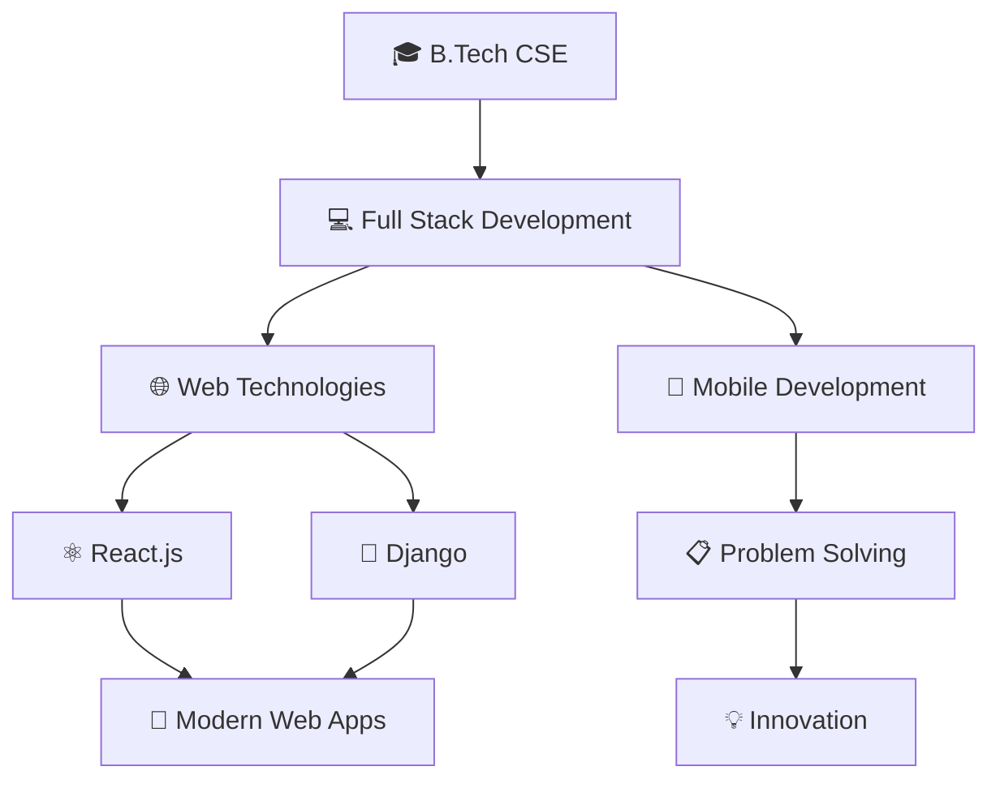

#        Hey there! I'm Vaibhav Katiyar

<div align="center">
  
</div>

---

## 🚀 About Me

```java
public class VaibhavKatiyar {
    private String name;
    private String[] programmingLanguages;
    private Map<String, String[]> technologies;
    private String currentFocus;
    private String funFact;
    
    public VaibhavKatiyar() {
        this.name = "Vaibhav Katiyar";
        this.programmingLanguages = {"Java", "Python", "JavaScript", "C++"};
        
        this.technologies = new HashMap<>();
        technologies.put("frontend", new String[]{"HTML", "CSS", "JavaScript", "React"});
        technologies.put("backend", new String[]{"Spring Boot", "Django", "Node.js"});
        technologies.put("database", new String[]{"MySQL", "MongoDB", "PostgreSQL"});
        technologies.put("tools", new String[]{"Git", "IntelliJ IDEA", "VS Code", "Linux"});
        
        this.currentFocus = "Full Stack Web Development";
        this.funFact = "I can debug Java stack traces faster than I can solve a Rubik's cube!";
    }
    
    public void sayHello() {
        System.out.println("Hey there! 👋");
        System.out.println("Thanks for visiting my profile!");
        System.out.println("Let's connect and build something amazing together! ☕");
    }
    
    public static void main(String[] args) {
        VaibhavKatiyar developer = new VaibhavKatiyar();
        developer.sayHello();
    }
}
```

---

## 🛠️ Tech Arsenal

<div align="center">

### Languages


### Frontend


### Backend & Databases


### Tools & Platforms


</div>

---

## 📊 GitHub Analytics

<div align="center">
  
  
</div>

<div align="center">
  
</div>

<div align="center">
  
**🎯 Total Contributions: 69** | **📈 Repositories: 12** | **⭐ Stars Earned: 25**

</div>

---

## 🎯 Current Focus

<div align="center">



</div>

---

## 🏆 Achievements & Highlights

<div align="center">

| 🎯 **Goals 2024** | ✅ **Completed** |
|:------------------:|:----------------:|
| Master React.js | 🔄 In Progress |
| Build 10 Projects | 🔄 6/10 |
| Contribute to Open Source | 🔄 Started |
| Learn Cloud Computing | 📅 Planned |

</div>

---

## 🤝 Let's Connect!

<div align="center">

[](https://linkedin.com/in/vaibhav-katiyar)
[](https://twitter.com/vaibhav_katiyar)
[](mailto:vaibhav.katiyar@example.com)
[](https://vaibhavkatiyar.dev)

</div>

---

## 📈 Activity Graph

<div align="center">
  
</div>

---

## 💭 Random Dev Quote

<div align="center">
  
</div>

---

<div align="center">
  
  
  **💙 If you like my work, consider giving it a ⭐!**
  
  *"Code is like humor. When you have to explain it, it's bad." – Cory House*
</div>
