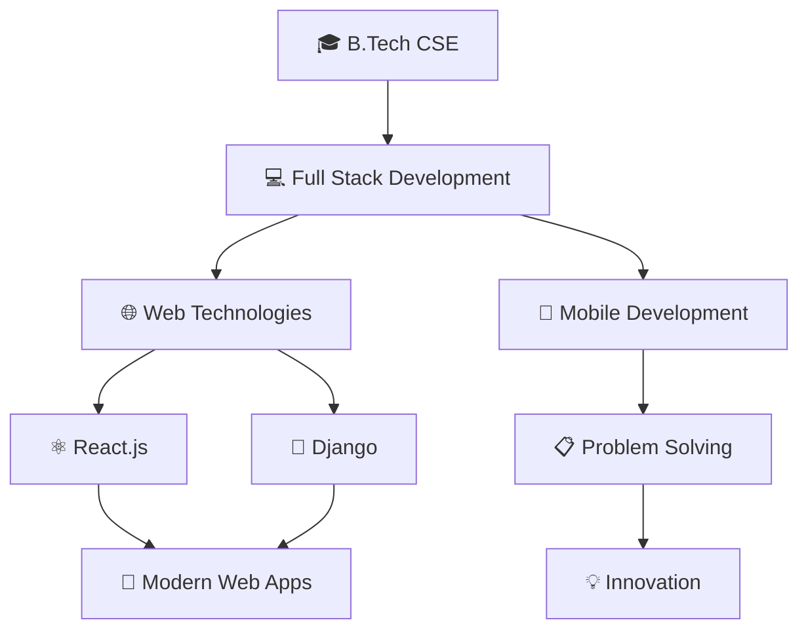

#  Hey there! I'm Vaibhav Katiyar

<div align="center">
  
</div>

---

## 🚀 About Me

```python
class VaibhavKatiyar:
    def __init__(self):
        self.username = "Vaibhav Katiyar"
        self.code = ["Python", "Java", "JavaScript", "C++"]
        self.technologies = {
            "frontend": ["HTML", "CSS", "JavaScript", "React"],
            "backend": ["Django", "Node.js", "Express"],
            "database": ["MySQL", "MongoDB", "PostgreSQL"],
            "tools": ["Git", "Docker", "VS Code", "Linux"]
        }
        self.current_focus = "Full Stack Web Development"
        self.fun_fact = "I debug with print statements and I'm not ashamed!"
    
    def say_hi(self):
        print("Thanks for dropping by! Let's connect and build something amazing together!")

me = VaibhavKatiyar()
me.say_hi()
```

---

## 🛠️ Tech Arsenal

<div align="center">

### Languages


### Frontend


### Backend & Databases


### Tools & Platforms


</div>

---

## 📊 GitHub Analytics

<div align="center">
  
  
</div>

<div align="center">
  
</div>

---

## 🎯 Current Focus

<div align="center">



</div>

---

## 🏆 Achievements & Highlights

<div align="center">

| 🎯 **Goals 2024** | ✅ **Completed** |
|:------------------:|:----------------:|
| Master React.js | 🔄 In Progress |
| Build 10 Projects | 🔄 6/10 |
| Contribute to Open Source | 🔄 Started |
| Learn Cloud Computing | 📅 Planned |

</div>

---

## 🤝 Let's Connect!

<div align="center">

[](https://linkedin.com/in/vaibhav-katiyar)
[](https://twitter.com/vaibhav_katiyar)
[](mailto:vaibhav.katiyar@example.com)
[](https://vaibhavkatiyar.dev)

</div>

---

## 📈 Activity Graph

<div align="center">
  
</div>

---

## 💭 Random Dev Quote

<div align="center">
  
</div>

---

## 🎵 Spotify Playing

<div align="center">
  
</div>

---

<div align="center">
  
### 🐍 Contribution Snake


</div>

---

<div align="center">
  
  
  **💙 If you like my work, consider giving it a ⭐!**
  
  *"Code is like humor. When you have to explain it, it's bad." – Cory House*
</div>

---

<div align="center">
  <h3>⚡ Fun Fact</h3>
  <p><em>I can solve a Rubik's cube faster than I can fix a CSS alignment issue! 🎲</em></p>
</div>
